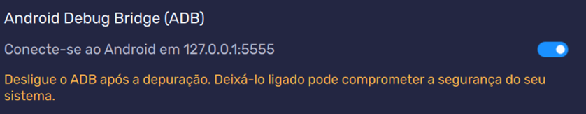

TUTORIAL WIDGETS FLUTTER

1 ° passo – instalar e configurar corretamente
Antes de começar, certifique-se de que você tem os seguintes itens instalados:
•	Flutter SDK .
•	BlueStacks 5 .
•	Git instalado (para clonar o repositório).
•	Um editor de código (como Visual Studio Code ou Android Studio).

2° passo – Configurar Bluestacks 5
1.	Abrir as configurações do BlueStacks 5
2.	Ir em Avançado

 
  
3° passo –  Criação do Projeto
1.	Abrir o Visual Studio Code.
2.	Pressione Ctrl + Shift + P para abrir o menu de comandos.
3.	Digite e selecione "Flutter: New Project".
4.	Escolha a Pasta de Destino: Selecione a pasta onde você deseja criar o projeto.
5.	Configurar o Flutter: Siga as instruções na tela para configurar seu projeto Flutter.
6.	Criar projeto com o nome de sua escola 

4° passo - Estruturar o Código
•	Abrir projeto
•	lib/main.dart

1.	Importações
import 'package:flutter/material.dart';

2.	Função Principal
void main() { 
      runApp(MyApp()); 
}

3.	Classe MyApp
class MyApp extends StatelessWidget {
  @override
  Widget build(BuildContext context) {
    return MaterialApp(
      title: 'Flutter Demo',
      theme: ThemeData(primarySwatch: Colors.blue),
      home: HomePage(),
    );
  }
}

4.	Classe HomePage

class HomePage extends StatelessWidget {
  @override
  Widget build(BuildContext context) {
    return Scaffold(
      appBar: AppBar(title: Text('Home Page')),
      body: Column(
        mainAxisAlignment: MainAxisAlignment.center,
        children: [
          Text('Bem-vindo ao Flutter!'),
          Row(
            mainAxisAlignment: MainAxisAlignment.center,
            children: [
              ElevatedButton(
                child: Text('Ir para o Formulário'),
                onPressed: () {
                  Navigator.push(
                    context,
                    MaterialPageRoute(builder: (context) => FormPage()),
                  );
                },
              ),
              SizedBox(width: 20),
              ElevatedButton(
                child: Text('Outro Botão'),
                onPressed: () {},
              ),
            ],
          ),
          Stack(
            alignment: Alignment.center,
            children: [
              Container(width: 100, height: 100, color: Colors.blue),
              Container(width: 50, height: 50, color: Colors.red),
            ],
          ),
        ],
      ),
    );
  }
}

5.	Classe FormPage

class FormPage extends StatefulWidget {
  @override
  _FormPageState createState() => _FormPageState();
}

class _FormPageState extends State<FormPage> {
  final _formKey = GlobalKey<FormState>();
  String _name = '';

  @override
  Widget build(BuildContext context) {
    return Scaffold(
      appBar: AppBar(title: Text('Formulário')),
      body: Padding(
        padding: const EdgeInsets.all(16.0),
        child: Form(
          key: _formKey,
          child: Column(
            children: [
              TextFormField(
                decoration: InputDecoration(labelText: 'Nome'),
                validator: (value) {
                  if (value == null || value.isEmpty) {
                    return 'Por favor, insira seu nome';
                  }
                  return null;
                },
                onChanged: (value) {
                  setState(() {
                    _name = value;
                  });
                },
              ),
              SizedBox(height: 20),
              ElevatedButton(
                child: Text('Enviar'),
                onPressed: () {
                  if (_formKey.currentState!.validate()) {
                    ScaffoldMessenger.of(context).showSnackBar(
                      SnackBar(content: Text('Olá, $_name!')),
                    );
                  }
                },
              ),
            ],
          ),
        ),
      ),
    );
  }
}

5° passo - Abrir Aplicação

